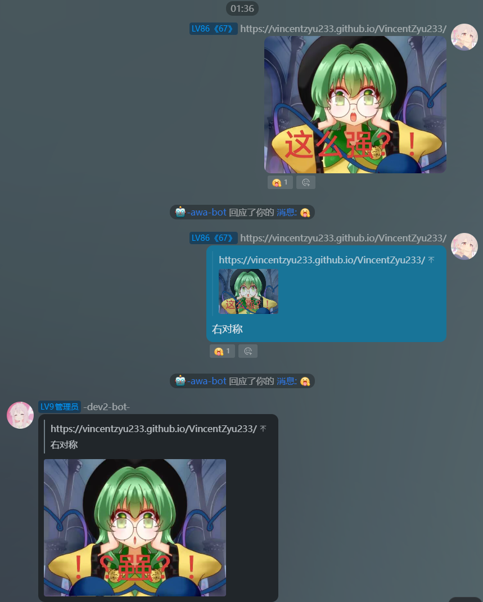
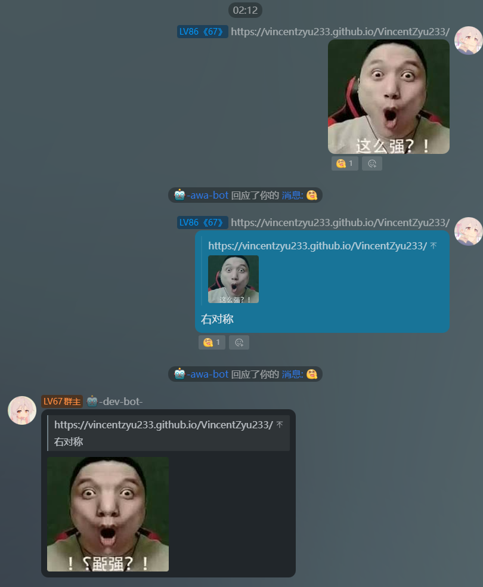

# koishi-plugin-pics-changer3

对图片进行左右上下对称翻转，形成轴对称图

## 效果预览

引用图片并发送 `右对称`，保留右半边并镜像到左半边；开启 `enableQuote` 时，机器人会引用触发指令的消息回复。

## 配置

配置页面使用 `Schema.intersect` 分组，基础设置位于指令设置之前。

| 分组 | 配置项 | 默认值 | 说明 |
| --- | --- | --- | --- |
| 基础设置 | `enableQuote` | `true` | bot发送消息时是否引用触发指令的原始消息，包括图片、帮助、等待提示、超时提示、无效图片提示及错误消息；等待补图后仍引用原指令消息 |
| 基础设置 | `promptTimeout` | `30` | 等待用户发送图片的超时时间，单位为秒 |
| 指令设置 | `upsymmetry` | `上对称` | 上对称指令 |
| 指令设置 | `downsymmetry` | `下对称` | 下对称指令 |
| 指令设置 | `leftsymmetry` | `左对称` | 左对称指令 |
| 指令设置 | `rightsymmetry` | `右对称` | 右对称指令 |
| 指令设置 | `defaultsymmetry` | `对称` | 默认帮助指令，仅显示帮助，不处理图片 |

## 指令

| 默认指令 | 效果 |
| --- | --- |
| `对称` | 显示所有对称指令的帮助信息，不处理图片 |
| `上对称` | 保留上半边，沿水平中线将上半边上下镜像到下半边，覆盖原下半边 |
| `下对称` | 保留下半边，沿水平中线将下半边上下镜像到上半边，覆盖原上半边 |
| `左对称` | 保留左半边，沿垂直中线将左半边左右镜像到右半边，覆盖原右半边 |
| `右对称` | 保留右半边，沿垂直中线将右半边左右镜像到左半边，覆盖原左半边 |

## 使用方法

> - 支持静态图片和 GIF 动图，可一次附带多张图片。
> - 方向指令可以附图发送，也可以引用含图片的消息后发送，引用图片优先。
> - 单独发送方向指令时，会等待补图，默认等待 30 秒。
> - 这些操作生成对称图，不是整图翻转。
> - 各方向指令也支持 `--help`，例如 `左对称 --help`。
> - 自定义指令名后，帮助会使用实际配置的名称。
